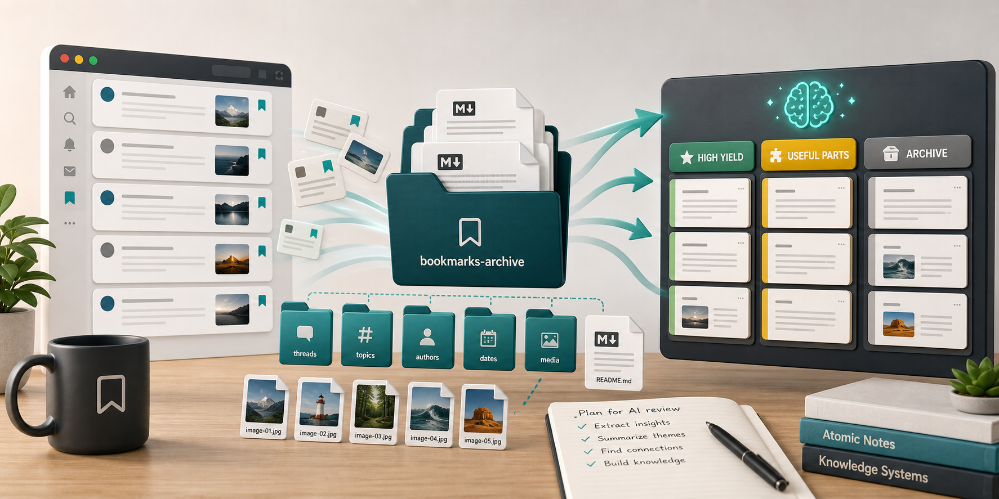

# X Bookmark Scraper



## About

This was a 100% vibe coded project in a coffee shop on memorial day. As someone who uses X to keep up with AI research and other fields, I tend to fall into a trap of bookmarking everything that seems relevant/interesting with the intent of going back and reading them, then realizing this would take hours. This tools aim is to make this process less taxing and make archiving easier. It scans your bookmarks from newest to oldest and skips all posts already archived. It scraps n amount of posts (default = 5), takes the text, images and videos from the post/thread and turns them into organized Markdown folders. This tool is designed in mind to be ran through a filter, for me this is a /skill built specifically for my research interests so I can filter out posts that seemed relevant but ended up not being, or a post that seemed high yield but really was just AI slop. 

This tool uses a local Playwright browser profile to access your X bookmarks.

## Disclaimer

Since this project was 100% vibe coded in about 1 hour, I am not planning on updating it or working on optimization. If you run into difficulty with the setup due to X blocking your login, try the debugging tips below (If you are using Claude/Codex you can just ask them to debug this for you as well). 

## Setup

```powershell
python -m venv .venv
.\.venv\Scripts\Activate.ps1
pip install -r requirements.txt
python -m playwright install chromium
```

## Sign in once

```powershell
python x_bookmark_scraper.py --login
```

Log into X in the browser window, then press Enter in the terminal. The session is saved in `.x_browser_profile/`.
This is separate from your normal Chrome/Edge browser login, so run this at least once before scraping.

If X or Google flags the default Playwright Chromium browser as unusual, use your installed browser instead:

```powershell
python x_bookmark_scraper.py --login --browser-channel chrome
python x_bookmark_scraper.py --limit 5 --browser-channel chrome
```

If you prefer Microsoft Edge:

```powershell
python x_bookmark_scraper.py --login --browser-channel msedge
python x_bookmark_scraper.py --limit 5 --browser-channel msedge
```

Keep using the scraper's `.x_browser_profile/` folder rather than your everyday Chrome profile. It avoids profile-lock problems while still launching through a normal installed browser.

## If X Still Flags The Browser

The next workaround is to launch Chrome yourself with remote debugging, log in manually, and let the scraper attach to that already-open browser.

Close other Chrome windows first, then run:

```powershell
Start-Process "$env:ProgramFiles\Google\Chrome\Application\chrome.exe" -ArgumentList @(
  "--remote-debugging-port=9222",
  "--user-data-dir=$PWD\.chrome_cdp_profile"
)
```

If Chrome is installed under Program Files (x86), use:

```powershell
Start-Process "${env:ProgramFiles(x86)}\Google\Chrome\Application\chrome.exe" -ArgumentList @(
  "--remote-debugging-port=9222",
  "--user-data-dir=$PWD\.chrome_cdp_profile"
)
```

In that Chrome window, log into X and confirm bookmarks load. Then run:

```powershell
python x_bookmark_scraper.py --limit 5 --cdp-url http://127.0.0.1:9222
```

This mode attaches to the browser you opened instead of launching a new automation-looking browser. Keep that Chrome window open while scraping.

## Scrape bookmarks

```powershell
python x_bookmark_scraper.py --limit 5
```

The scraper only starts from `https://x.com/i/bookmarks`, scans newest to oldest, skips posts already stored in `state/processed_bookmarks.json`, and writes each bookmark to:

If the Playwright profile is not signed in, the scraper prints the current X page, visible page text, and the exact `--login` command to run instead of silently reporting an empty scrape.

```text
scraped_bookmarks/
  2026-05-25_short-post-slug_1234567890/
    scrape.md
    image-1.jpg
    image-2.jpg
```

It also maintains `scraped_bookmarks/bookmarks_index.md`.

## Useful options

```powershell
python x_bookmark_scraper.py --limit 10
python x_bookmark_scraper.py --headed
python x_bookmark_scraper.py --thread-scrolls 10
python x_bookmark_scraper.py --browser-channel chrome
python x_bookmark_scraper.py --output "C:\path\to\folder"
```

Use a small `--limit` to keep the laptop load low. New bookmarks added later will appear near the top of the bookmarks page and will be picked up before older unsaved backlog items.
